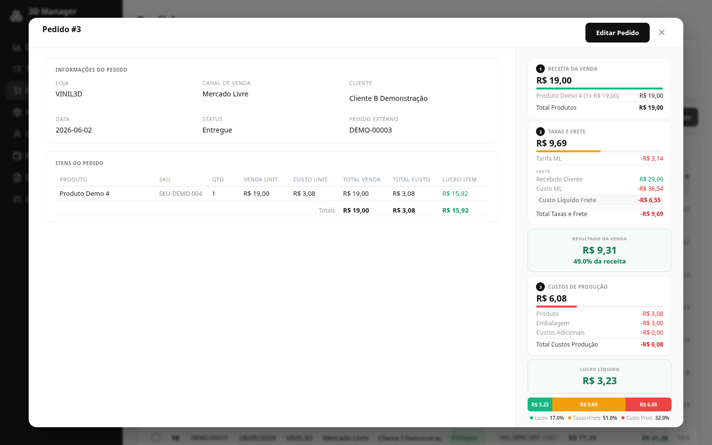

<div align="center">
  <h1>3D Manager</h1>
  <p align="center">
    <em>Sistema de gestão de pedidos e financeiro<br/>
    customizado para loja de produtos impressos em 3D</em>
  </p>
  <p>
    
    
    
    
    <br/>
    
    
  </p>
</div>

---

## Índice

- [Sobre](#sobre)
- [Funcionalidades](#funcionalidades)
- [Regras de Negócio](#regras-de-negócio)
- [Stack](#stack)
- [Arquitetura](#arquitetura)
- [Componentes & Hooks compartilhados](#componentes--hooks-compartilhados)
- [Módulos de domínio](#módulos-de-domínio)
- [Ambiente](#ambiente)
- [Scripts](#scripts)
- [Testes](#testes)
- [CI/CD](#cicd)
- [Fluxo de Trabalho](#fluxo-de-trabalho)

---

## Sobre

O **3D Manager** nasceu da necessidade de uma loja de impressão 3D que vendia em marketplaces (Mercado Livre, Shopee) e redes sociais (Instagram, WhatsApp) e não encontrava um sistema que encaixasse nas particularidades do negócio — cálculo de custo por grama de filamento, margem por peça, frete subsidiado vs. recebido, e a realidade de ter pedidos entregues mas ainda não recebidos (o famoso "a realizar").

Em vez de adaptar a loja ao software, o software foi feito sob medida para a loja.

---

## Funcionalidades

### 📦 Controle de Pedidos
- Ciclo completo: Novo → Enviado → Entregue / Devolvido / Cancelado
- Transições de status validadas no backend
- Suporte a **múltiplas lojas** e canais de venda (Mercado Livre, Shopee, Instagram, WhatsApp, Site)
- Filtros por data, status, loja, canal e busca textual
- Auto-estorno financeiro ao marcar como Devolvido no Mercado Livre
- Sidebar financeiro em cascata (Receita → Taxas/Frete → Custo Produção → Lucro)

| Listagem | Detalhe do Pedido |
|----------|-------------------|
|  |  |

### 📥 Importação de Pedidos (Mercado Livre)
- Upload de planilha XLSX com preview antes de confirmar
- Parse automático: mapeamento de status ML → interno
- Detecção de duplicatas e SKUs faltantes
- Agregação de "Pacote de diversos" em pedido único
- Merge inteligente de clientes (por documento ou nome+CEP)

### 💸 Importação de Extrato MP (Mercado Pago)
- Upload de CSV de settlement do Mercado Pago
- Detecção de estornos (DISPUTE) e estornos de frete (DISPUTE_SHIPPING)
- Vinculação automática com pedidos por `PACK_ID` ou `ORDER_ID`
- Detecção de divergências entre valor recebido × esperado por pedido


### 💰 Financeiro
- Lançamentos de receitas e despesas avulsos
- **Categorias** personalizáveis por tipo (income / expense)
- **Classificação** de despesas em **fixas** e **variáveis**
- **DRE** completo com separação **Realizado** × **A Realizar**
  - Realizado = pedido entregue com receita vinculada
  - A Realizar = pedido entregue ainda não faturado
- Saldo inicial configurável
- Detecção de divergências e transações órfãs


### 📊 Dashboard e KPIs
- Faturamento bruto, resultado da venda, lucro e margem
- Ticket médio, comparação com período anterior
- Gráfico de receita × despesa com agrupamento automático (diário, semanal, mensal)
- Filtro por data com exclusão automática de devolvidos
- Tooltip on-hover com breakdown de cada KPI


### 🏭 Produtos e Calculadora de Custo
- Cadastro com SKU, peso, tempo de impressão e custo adicional
- **Calculadora integrada** que considera:
  - **Material**: consumo de PLA com base no peso da peça
  - **Energia**: custo por hora da impressora
  - **Máquina**: depreciação + manutenção do equipamento
  - **Taxa de erro**: margem de segurança sobre o subtotal
- Preços de venda por canal com markup automático
- Recalculo retroativo de custo em pedidos existentes (por data ou global)

| Produtos | Calculadora de Custo |
|----------|----------------------|
|  |  |

### 👥 Clientes
- Cadastro com histórico de pedidos e segmentação automática:
  - 🟢 **Novo** — primeira compra há ≤ 30 dias
  - 🔵 **Recorrente** — mais de um pedido
  - 🟡 **Ouro** — top 10% em receita bruta acumulada
  - ⚪ **Inativo** — sem compras há > 180 dias
- Deduplicação por documento (fallback nome+CEP)
- Detalhe do cliente com KPIs e histórico paginado de pedidos
- Merge de dados na importação

| Clientes | Detalhe do Cliente |
|----------|-------------------|
|  |  |

### 📋 Kanban (Tasks / Ideias / To-Dos)
- Quadro de tarefas com colunas customizáveis (default: Backlog, Fazendo, Pronto)
- Drag-and-drop entre colunas
- Conclusão automática com timestamp ao mover para coluna de "Pronto"
- Cards com descrição, prioridade e data de vencimento


### 🔐 Autenticação (opcional)
- Sistema de sessão com hash de senha (scrypt + timingSafeEqual)
- Rate limit de login (5 tentativas / 15 min)
- Configuração única de senha via tela de Setup
- Cookie HttpOnly + SameSite=Strict, 8h de expiração

### 📎 Outros
- **Auditoria**: log de todas as operações CUD em `audit_log`
- **Backup automático**: a cada hora com política de retenção (30 dias diários + 1 por mês)
- **Importação por progresso**: jobs pesados rodam async e o frontend faz polling

---

## Regras de Negócio

<details>
<summary>Cálculo de custo de produção</summary>

```
material = (pesoGramas / 1000) × precoPLAPorKg
energia  = tempoImpressaoMin × (custoEnergiaHora / 60)
maquina  = tempoImpressaoMin × (valorImpressora / vidaUtilHoras / 60) × (1 + manutencao/100)
subtotal = material + energia + maquina + custosAdicionais
custoErro = subtotal × (taxaErro / 100)
custoTotal = subtotal + custoErro
```
</details>

<details>
<summary>Fórmulas financeiras por pedido</summary>

```
subsidioFrete    = freteTotal − freteRecebido
receitaBruta     = valorProdutos + freteRecebido
custoOperacional = taxaPlataforma + freteTotal + outrosCustos + embalagem + custosAdicionais − desconto
receitaLiquida   = receitaBruta − custoOperacional
lucro            = receitaLiquida − custoItens
margem%          = (lucro / receitaBruta) × 100
resultadoVenda   = receitaBruta − taxaPlataforma − freteTotal − outrosCustos + desconto
```
</details>

<details>
<summary>Regra "Devolvido zera"</summary>

Pedidos com status `Devolvido` têm **todos** os valores financeiros zerados (estorno):
- `products_amount_cents = 0`
- `shipping_total_cents = 0`, `shipping_customer_cents = 0`
- `platform_fee_cents = 0`, `discount_cents = 0`
- `other_costs_cents = 0` (cupom)
- `amount_received_cents = 0`
- `packaging_cents = 0`, `additional_costs_cents = 0`
- `cost_unit_cents` de todos os itens = 0

A regra é centralizada em `server/financials.ts` e aplicada em:
- `importer.ts` (insert + update de pedidos importados do ML)
- `routes/orders.ts` (PUT `/api/orders/:id/status` quando canal = Mercado Livre)
- `importerMp.ts` (atualiza o `other_costs_cents` no DRE em caso de estorno)
</details>

<details>
<summary>DRE: Realizado × A Realizar</summary>

O DRE separa pedidos **Entregue** em dois grupos:
- **Realizado**: possuem ao menos uma transação de receita vinculada
- **A Realizar**: não possuem nenhuma transação de receita vinculada

Isso reflete a realidade do mercado: o produto foi entregue, mas o dinheiro ainda não caiu na conta.
</details>

Para a lista completa, veja [`docs/regras-de-negocio.md`](docs/regras-de-negocio.md).

---

## Stack

| Camada | Tecnologia | Versão |
|--------|-----------|---------|
| **Frontend** | React | 18 |
| | TypeScript | 5 |
| | Vite | 5 |
| | React Query (TanStack) | 5 |
| | @dnd-kit | 6 |
| | lucide-react (ícones) | 0.468 |
| | recharts (gráficos) | 3 |
| **Backend** | Node.js | 18+ |
| | Fastify | 4 |
| | TypeScript | 5 |
| | Zod (validação) | 3 |
| **Banco** | SQLite 3 | via CLI (`execFileSync`) |
| **Importação** | xlsx (parse de planilhas do Mercado Livre) | 0.18 |
| **Build** | tsc + Vite | |

---

## Arquitetura

```
3D Manager
├── server/                                 # Backend (Fastify + TypeScript)
    │   ├── index.ts                            # Entry point (80 linhas): Fastify setup, plugins, route registration
    │   ├── db.ts                               # Schema, migrações, seed, conexão SQLite
    │   ├── calculations.ts                     # Fórmulas financeiras de pedido (re-exportado para o frontend via src/ui/finance.ts)
    │   ├── financials.ts                       # ⭐ Regra "Devolvido zera" + match product by title + cupom
│   ├── brazilianStates.ts                  # ⭐ UF → nome completo (fonte única)
│   ├── importer.ts                         # Importação de pedidos do Mercado Livre (XLSX)
│   ├── importerMp.ts                       # Importação de extrato Mercado Pago (CSV)
│   ├── importShared.ts                     # Mapeamento de status ML → status interno
│   ├── xlsxParser.ts                       # Parse de XLSX com detecção de "Pacote de diversos"
│   ├── statusConfig.ts                     # Transições válidas de status de pedido
│   ├── auth.ts                             # Hash de senha + sessão em memória
│   ├── middleware/auth.ts                  # Bloqueia rotas /api/* se AUTH_ENABLED=true
│   ├── routes/                             # Rotas modulares da API (ver server/routes/README.md)
│   │   ├── orders.ts                       # CRUD de pedidos + transições de status + auto-estorno
│   │   ├── products.ts                     # CRUD de produtos + recálculo retroativo
│   │   ├── customers.ts                    # CRUD de clientes + segmentação
│   │   ├── imports.ts                      # Upload e preview de XLSX/CSV
│   │   ├── dashboard.ts                    # Agregações de KPI
│   │   ├── finance.ts                      # Transações financeiras + DRE
│   │   ├── todos.ts                        # Kanban de tarefas
│   │   ├── admin.ts                        # Meta, stores, settings, audit-log
│   │   ├── auth.ts                         # Login, logout, status de sessão
│   │   ├── backups.ts                      # Listagem e restore de backups
│   │   └── helpers.ts                      # Wrappers SQL compartilhados
│   └── scripts/
│       ├── backup.ts                       # Backup manual do banco de produção
│       ├── seed-fake.ts                    # Geração de dados fake para testes
│       └── wait-for-port.mjs               # Helper para `dev:web` esperar API subir
│
├── src/                                    # Frontend (React + Vite)
│   ├── main.tsx                            # Entry point
│   ├── styles.css                          # CSS global
│   ├── hooks/                              # Hooks reutilizáveis
│   │   ├── useDeleteMutation.ts            # Wrapper de useMutation para DELETE
│   │   ├── useSelection.ts                 # Estado de seleção (checkbox múltiplo)
│   │   ├── useSort.ts                      # ⭐ Ordenação de tabelas com state
│   │   └── useDatePresets.ts               # ⭐ Cálculo de ranges (today/7d/30d/etc)
│   ├── shared/                             # ⭐ Código compartilhado front/back (espelhado)
│   │   └── brazilianStates.ts              # Lista de UFs
│   └── ui/
│       ├── App.tsx                         # 125 linhas: auth state + sidebar + routing
│       ├── api.ts                          # Tipos compartilhados + função `api()` (FormData-safe)
│       ├── finance.ts                      # Re-export de `calculateOrderTotals`
│       ├── dashboard-types.ts              # Tipos do Dashboard
│       ├── dashboard/                      # Componentes do dashboard
│       │   ├── Dashboard.tsx
│       │   ├── DashboardKpiRow.tsx
│       │   ├── DashboardDaily.tsx
│       │   ├── DashboardCompBar.tsx
│       │   ├── DashboardChart.tsx
│       │   └── DashboardChannels.tsx
│       ├── views/                          # ⭐ Páginas principais (extraídas de App.tsx)
│       │   ├── ProductsView.tsx            # Lista de produtos + modais
│       │   ├── CustomersView.tsx            # Lista de clientes + filtros + modal de cadastro
│       │   ├── OrdersView.tsx               # Lista de pedidos + KPIs + tooltips
│       │   └── SettingsView.tsx             # Lojas, parâmetros, auditoria, backup
│       ├── PageHeader.tsx                  # ⭐ Cabeçalho reutilizável de página
│       ├── Panel.tsx                       # ⭐ Seção com título
│       ├── KpiCard.tsx                     # ⭐ Card de KPI (com e sem destaque)
│       ├── DatePresetBar.tsx               # ⭐ Botões de preset + inputs de data
│       ├── ModalShell.tsx                  # Modal base (com/sem form)
│       ├── Notification.tsx                 # Banner de feedback
│       ├── ConfirmDeleteModal.tsx          # Modal de confirmação com dependências
│       ├── FormActions.tsx                 # Botões "Salvar" / "Cancelar"
│       ├── Pagination.tsx                  # Controles de paginação
│       ├── Autocomplete.tsx                # Input com sugestões
│       ├── Login.tsx, Setup.tsx, AuthForm.tsx   # Fluxo de autenticação
│       ├── OrderModal.tsx, OrderDetailModal.tsx, OrderFinancialSidebar.tsx
│       ├── ProductModal.tsx
│       ├── CustomerDetailModal.tsx
│       ├── ImportView.tsx, ImportSettlementView.tsx
│       ├── FinanceView.tsx
│       ├── KanbanView.tsx
│       └── utils/                          # ⭐ Utilitários puros
│           ├── validators.ts               # CPF/CNPJ
│           └── format.ts                   # formatBytes
│
├── docs/                                   # Documentação complementar
│   ├── regras-de-negocio.md                # RNs detalhadas
│   ├── ambiente-dev-prod.md                # Setup de dev e produção
│   ├── architecture.md                     # ⭐ Diagrama + fluxo de dados
│   ├── development.md                      # ⭐ Como rodar, debugar, adicionar view
│   └── screenshots/                        # Capturas de tela
│
├── data/                                   # Bancos SQLite (gitignored)
│   ├── dev.sqlite                          # Desenvolvimento
│   ├── prod.sqlite                         # Produção
│   └── backups/                            # Backups automáticos
│
└── dist/ + dist-server/                    # Outputs de build (gitignored)
```

### Decisões técnicas

- **Valores monetários** armazenados como `INTEGER` em centavos (nunca `FLOAT`)
- **Separação de ambientes** via `DB_ENV` — dois bancos SQLite independentes (`dev.sqlite` / `prod.sqlite`)
- **Autenticação opcional** controlada por variável de ambiente `AUTH_ENABLED`
- **API REST** com validação de entrada via Zod em todas as rotas
- **Frontend SPA** com React Query para cache e sincronização de dados
- **Regra de negócio centralizada**: `server/financials.ts` é a única fonte da verdade para "Devolvido zera", evitando drift entre importer, preview e update de status

---

## Componentes & Hooks compartilhados

| Módulo | Responsabilidade | Onde é usado |
|--------|------------------|--------------|
| `src/hooks/useSort` | Ordenação de tabelas (state + handler + memo) | `ProductsView`, `CustomersView`, `OrdersView`, `FinanceView` |
| `src/hooks/useSelection` | Estado de seleção de checkbox múltiplo | Todas as views com bulk delete |
| `src/hooks/useDeleteMutation` | Wrapper de `useMutation` para DELETE com invalidação automática | Todas as views com exclusão |
| `src/hooks/useDatePresets` | Cálculo de ranges de data (today/7d/30d/month/lastmonth/all) | `DatePresetBar` |
| `src/shared/brazilianStates` | Lista de UFs + helpers `getStateName` / `getStateAbbreviation` | Backend (filtro de customers) + frontend (dropdown) |
| `src/ui/PageHeader` | Cabeçalho `<h1>` + subtítulo | Todas as views |
| `src/ui/Panel` | Seção com `<h2>` + conteúdo | Todas as views com tabelas |
| `src/ui/KpiCard` / `KpiHero` | Card de KPI | Dashboard, OrdersView, CustomersView, FinanceView |
| `src/ui/DatePresetBar` | Botões de preset + inputs manuais de data | `OrdersView`, `CustomersView`, `Dashboard`, `FinanceView` |
| `src/ui/ModalShell` | Modal base reutilizável (com/sem form) | Todos os modais |
| `src/ui/utils/validators` | `validateDocument` (CPF/CNPJ) | `CustomersView` |
| `src/ui/utils/format` | `formatBytes` | `SettingsView` |

---

## Módulos de domínio

### Backend

- **`server/calculations.ts`** — funções puras de cálculo financeiro. Recebe inputs do banco, retorna `{grossRevenue, profit, margin, ...}`. Sem dependência de DB.
- **`server/financials.ts`** — regra de negócio "Devolvido zera" + cálculo de cupom + match de produto por título. Centraliza a lógica que antes estava duplicada em 4 lugares.
- **`server/statusConfig.ts`** — transições válidas de status (`novo → enviado`, `enviado → entregue`, etc.) + helpers `getStatusId`, `isDevolvido`, `resolveTransitions`.
- **`server/brazilianStates.ts`** — tabela UF → nome completo. Exporta `STATE_NAMES`, `STATES`, `getStateName`, `getStateAbbreviation`.
- **`server/importShared.ts`** — `mapStatus` (ML → interno) e `normalize` (acentos).
- **`server/auth.ts`** — hash de senha (scrypt) + sessão em memória. Sessão expira após 8h de inatividade.

### Frontend

- **`src/ui/finance.ts`** — re-export de `calculateOrderTotals`. Existe para que o frontend possa usar as funções sem importar diretamente do backend.
- **`src/ui/api.ts`** — tipos compartilhados (Product, Customer, Order, etc) + função `api()` com suporte automático a FormData.
- **`src/ui/dashboard-types.ts`** — tipos específicos do Dashboard (separados para não inflar `api.ts`).

---

## Ambiente

| Variável | Efeito | Padrão |
|----------|--------|--------|
| `DB_ENV` | Define qual banco SQLite usar (`dev`, `prod`, `test`) | `dev` |
| `AUTH_ENABLED` | Habilita autenticação por senha | `false` |
| `WAIT_TIMEOUT` | Timeout (ms) do `wait-for-port.mjs` | `60_000` |

### Bancos

| Ambiente | Arquivo | Quando usar |
|----------|---------|-------------|
| `dev` (padrão) | `data/dev.sqlite` | Desenvolvimento local |
| `prod` | `data/prod.sqlite` | Produção |
| `test` | `data/test.sqlite` | Rodar testes (definido em `vitest.config.ts`) |

---

## Scripts

| Comando | Descrição |
|---------|-----------|
| `npm run dev` | Sobe backend + frontend (banco dev, sem auth) |
| `npm run dev:auth` | Modo dev com autenticação habilitada |
| `npm run dev:api` | Apenas o backend (porta 3333) |
| `npm run dev:web` | Apenas o frontend (Vite, porta 5173) |
| `npm run build` | Compila TypeScript e empacota o frontend |
| `npm run start` | Sobe servidor de produção (porta 3333) |
| `npm run backup` | Backup manual do banco de produção |
| `npm test` | Roda os 244 testes (vitest, single-run) |
| `npm run test:watch` | Roda os testes em watch mode |

---

## Testes

**Total: 244 testes passando**, distribuídos em 20 arquivos (15 backend + 5 frontend).

### Backend (`server/__tests__/`)

| Arquivo | Testes | Cobre |
|---------|--------|-------|
| `calculations.test.ts` | 16 | Fórmulas financeiras (grossRevenue, profit, margem) |
| `brazilianStates.test.ts` | 19 | Conversão UF ↔ nome, case-insensitive, 27 UFs |
| `financials.test.ts` | 25 | Regra "Devolvido zera", cálculo de cupom, match product by title |
| `statusConfig.test.ts` | 12 | Transições válidas, isDevolvido |
| `db.test.ts` | 27 | Schema, migrações, seed |
| `crud.test.ts` | 14 | CRUD de orders, customers, products |
| `search.test.ts` | 14 | Busca textual + filtros |
| `dashboard.test.ts` | 8 | Endpoint `/api/dashboard` |
| `transactions.test.ts` | 16 | Receitas/despesas + DRE + categorias |
| `customer-summary.test.ts` | 3 | Agregação SQL de summary (incl. perf. 1000 pedidos) |
| `import-delivery-e2e.test.ts` | 10 | E2E: import de delivery dates |
| `import-ignored-orders.test.ts` | 5 | ignoredOrders vs duplicatedOrders na import ML |
| `parse-date.test.ts` | 12 | Parse de data Excel (série) ↔ ISO |
| `formula-consistency.test.ts` | 7 | Backend = frontend em fórmulas |
| `wait-for-port.test.ts` | 3 | Helper de port-wait |

### Frontend (`src/ui/__tests__/`)

| Arquivo | Testes | Cobre |
|---------|--------|-------|
| `api.test.ts` | 19 | Helper `api()` + tipos |
| `finance.test.ts` | 9 | `calculateKpisFromTotals` |
| `DashboardKpiRow.test.tsx` | 11 | KPIs financeiros e operacionais |
| `DashboardCompBar.test.tsx` | 5 | Barra de composição |
| `OrderFinancialSidebar.test.tsx` | 9 | Sidebar de pedido |

### Como rodar

```bash
npm test              # single-run
npm run test:watch    # watch mode
```

Os testes usam `data/test.sqlite` (configurado em `vitest.config.ts` via `env: { DB_ENV: 'test' }`).

---

## CI/CD

Workflow do GitHub Actions em `.github/workflows/ci.yml` roda em todo PR e push para `main`:

- ✅ `npm ci` (instala deps exatas do lockfile)
- ✅ `npm run build` (compila backend via `tsc -p tsconfig.server.json` + frontend via Vite — falha se houver erro de tipo)
- ✅ `npm test` (244 testes, ~1-2 min — o teste de performance de 1000 pedidos leva ~50s)

Para ativar proteção de branch: GitHub → Settings → Branches → main → marcar "Require status checks to pass".

---

## Fluxo de Trabalho

```
main (produção) ←── merge ── dev (desenvolvimento)
      │                           │
   npm run start               npm run dev
   data/prod.sqlite            data/dev.sqlite
```

1. Desenvolva na branch `dev` com `npm run dev`
2. Antes de publicar: `git checkout main && npm run backup`
3. Crie um PR de `dev` para `main` (CI valida automaticamente)
4. Merge: `git merge dev` (ou via botão "Merge" do GitHub se CI estiver passando)
5. Build: `npm run build`
6. Sobe: `npm run start`

Para mais detalhes, veja [`docs/development.md`](docs/development.md) e [`docs/architecture.md`](docs/architecture.md).

---

<div align="center">
  <sub>
    <a href="https://github.com/leozaneti/3dmanager">github.com/leozaneti/3dmanager</a>
  </sub>
</div>
