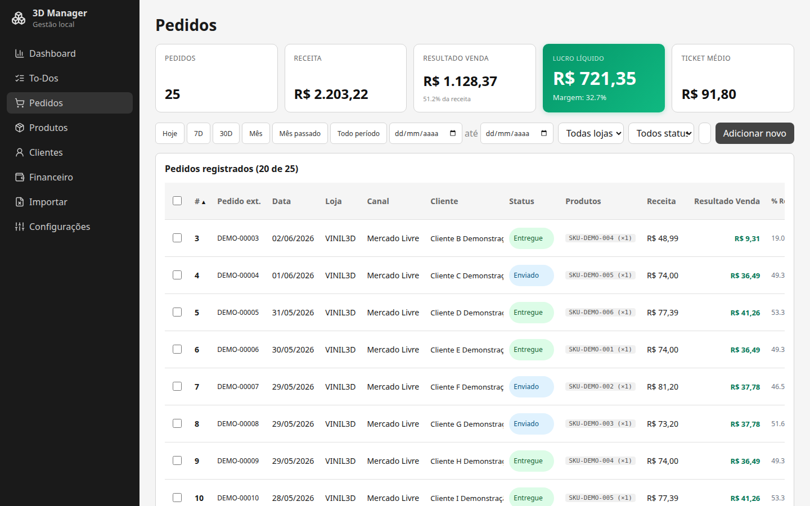
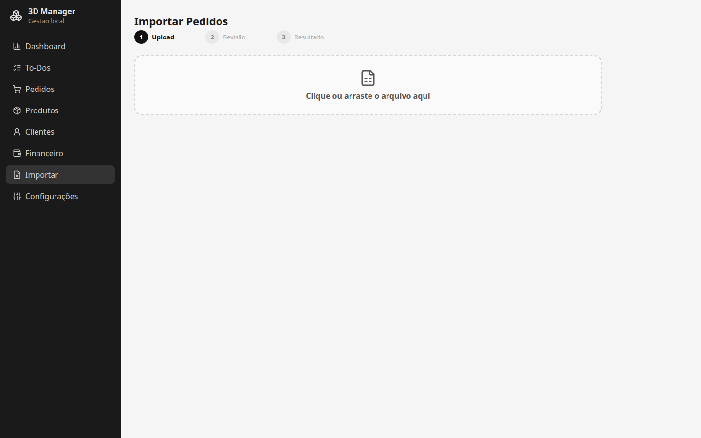
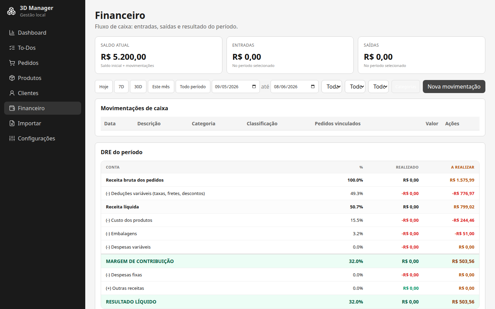
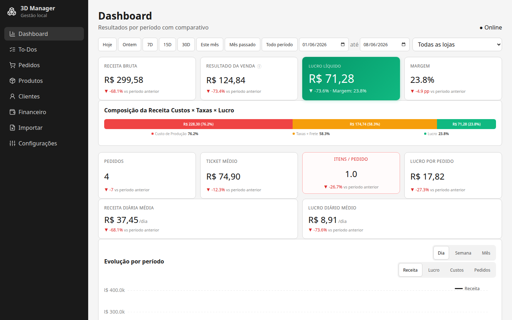
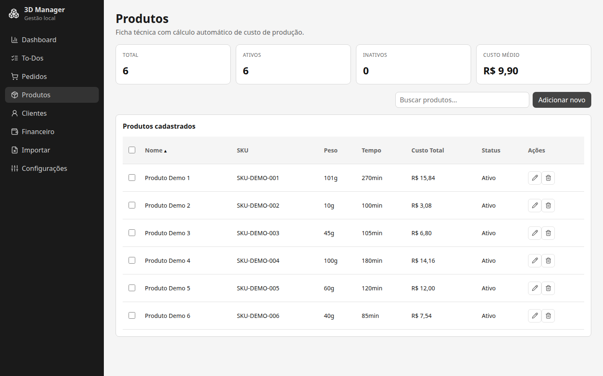
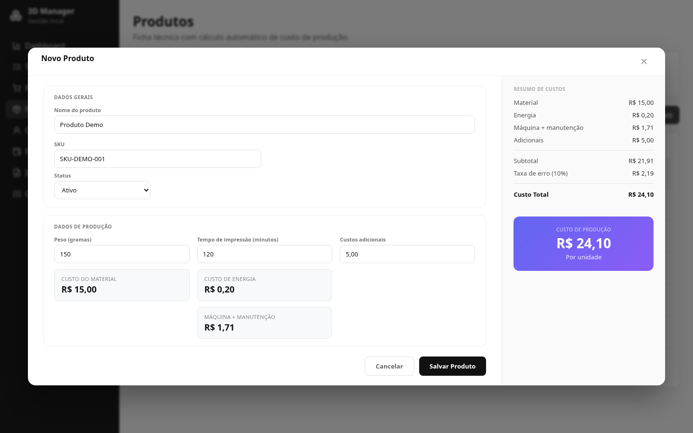
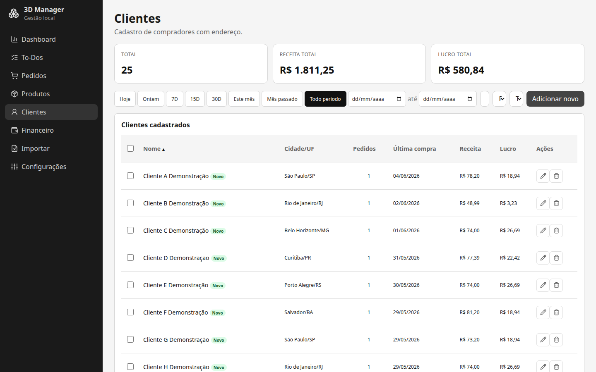
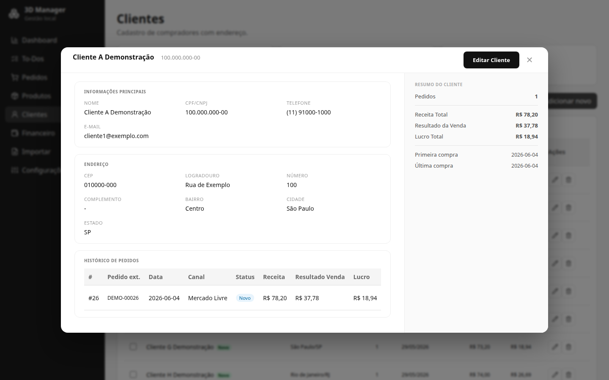
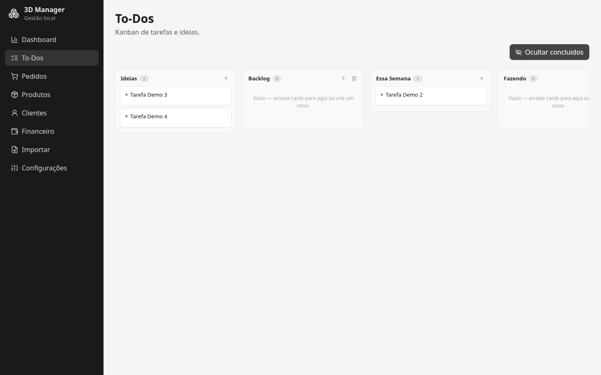

<div align="center">
  <h1>3D Manager</h1>
  <p align="center">
    <em>Sistema de gestão de pedidos e financeiro<br/>
    customizado para loja de produtos impressos em 3D</em>
  </p>
  <p>
    
    
    
    
  </p>
</div>

---

## Índice

- [Sobre](#sobre)
- [Funcionalidades](#funcionalidades)
- [Regras de Negócio](#regras-de-negócio)
- [Stack](#stack)
- [Arquitetura](#arquitetura)
- [Ambiente](#ambiente)
- [Scripts](#scripts)
- [Fluxo de Trabalho](#fluxo-de-trabalho)

---

## Sobre

O **3D Manager** nasceu da necessidade de uma loja de impressão 3D que vendia em marketplaces (Mercado Livre, Shopee) e redes sociais (Instagram, WhatsApp) e não encontrava um sistema que encaixasse nas particularidades do negócio — cálculo de custo por grama de filamento, margem por peça, frete subsidiado vs. recebido, e a realidade de ter pedidos entregues mas ainda não recebidos (o famoso "a realizar").

Em vez de adaptar a loja ao software, o software foi feito sob medida para a loja.

---

## Funcionalidades

### 📦 Controle de Pedidos
- Ciclo completo: Novo → Produção → Enviado → Entregue / Devolvido / Cancelado
- Transições de status validadas no backend
- Suporte a **múltiplas lojas** e canais de venda (Mercado Livre, Shopee, Instagram, WhatsApp, Site)
- Filtros por data, status, loja e busca textual
- Auto-estorno financeiro ao marcar como Devolvido no Mercado Livre



### 📥 Importação de Pedidos (Mercado Livre)
- Upload de planilha XLSX com preview antes de confirmar
- Parse automático: mapeamento de status ML → interno
- Detecção de duplicatas e SKUs faltantes
- Agregação de "Pacote de diversos" em pedido único
- Merge inteligente de clientes (por documento ou nome+CEP)



### 💰 Financeiro
- Lançamentos de receitas e despesas avulsos
- **Categorias** personalizáveis por tipo (income / expense)
- **Classificação** de despesas em **fixas** e **variáveis**
- **DRE** completo com separação **Realizado** × **A Realizar**
  - Realizado = pedido entregue com receita vinculada
  - A Realizar = pedido entregue ainda não faturado
- Saldo inicial configurável



### 📊 Dashboard e KPIs
- Faturamento bruto, resultado da venda, lucro e margem
- Ticket médio, comparação com período anterior
- Gráfico de receita × despesa com agrupamento automático (diário, semanal, mensal)
- Filtro por data com exclusão automática de devolvidos



### 🏭 Produtos e Calculadora de Custo
- Cadastro com SKU, peso, tempo de impressão e custo adicional
- **Calculadora integrada** que considera:
  - **Material**: consumo de PLA com base no peso da peça
  - **Energia**: custo por hora da impressora
  - **Máquina**: depreciação + manutenção do equipamento
  - **Taxa de erro**: margem de segurança sobre o subtotal
- Recalculo retroativo de custo em pedidos existentes (por data ou global)

| Produtos | Calculadora de Custo |
|----------|----------------------|
|  |  |

### 👥 Clientes
- Cadastro com histórico de pedidos e segmentação automática:
  - 🟢 **Novo** — primeira compra há ≤ 30 dias
  - 🔵 **Recorrente** — mais de um pedido
  - 🟡 **Ouro** — maior receita bruta acumulada
  - ⚪ **Inativo** — sem compras há > 180 dias
- Deduplicação por documento (fallback nome+CEP)
- Merge de dados na importação

| Clientes | Detalhe do Cliente |
|----------|-------------------|
|  |  |

### 📋 Kanban (Tasks / Ideias / To-Dos)
- Quadro de tarefas com colunas **Backlog**, **Fazendo** e **Pronto**
- Drag-and-drop entre colunas
- Conclusão automática com timestamp ao mover para "Pronto"
- Cards com descrição e posicionamento ajustável



### 🔐 Autenticação (opcional)
- Sistema de sessão com hash de senha
- Rate limit de login
- Configuração única de senha

### 📎 Outros
- **Auditoria**: log de todas as operações CUD
- **Backup automático**: a cada hora com política de retenção (30 dias diários + 1 por mês)

---

## Regras de Negócio

<details>
<summary>Cálculo de custo de produção</summary>

```
material = (pesoGramas / 1000) × precoPLAPorKg
energia  = tempoImpressaoMin × (custoEnergiaHora / 60)
maquina  = tempoImpressaoMin × (valorImpressora / vidaUtilHoras / 60) × (1 + manutencao/100)
subtotal = material + energia + maquina + custosAdicionais
custoErro = subtotal × (taxaErro / 100)
custoTotal = subtotal + custoErro
```
</details>

<details>
<summary>Fórmulas financeiras por pedido</summary>

```
subsidioFrete    = freteTotal − freteRecebido
receitaBruta     = valorProdutos + freteRecebido
custoOperacional = taxaPlataforma + freteTotal + outrosCustos + embalagem + custosAdicionais − desconto
receitaLiquida   = receitaBruta − custoOperacional
lucro            = receitaLiquida − custoItens
margem%          = (lucro / receitaBruta) × 100
resultadoVenda   = receitaBruta − taxaPlataforma − freteTotal − outrosCustos + desconto
```
</details>

<details>
<summary>DR: Realizado × A Realizar</summary>

O DRE separa pedidos **Entregues** em dois grupos:
- **Realizado**: possuem ao menos uma transação de receita vinculada
- **A Realizar**: não possuem nenhuma transação de receita vinculada

Isso reflete a realidade do mercado: o produto foi entregue, mas o dinheiro ainda não caiu na conta.
</details>

Para a lista completa, veja [`docs/regras-de-negocio.md`](docs/regras-de-negocio.md).

---

## Stack

| Camada | Tecnologia |
|--------|-----------|
| **Frontend** | React 18, TypeScript, Vite, React Query, @dnd-kit |
| **Backend** | Fastify 4, TypeScript, Zod (validação) |
| **Banco** | SQLite via sql.js |
| **Importação** | xlsx (parse de planilhas do Mercado Livre) |
| **Build** | tsc + Vite |

## Arquitetura

```
server/                         # Backend (Fastify + TypeScript)
├── index.ts                    # Rotas da API (~1922 linhas)
├── db.ts                       # Schema, migrações, seed, conexão
├── calculations.ts             # Fórmulas financeiras dos pedidos
├── importer.ts                 # Lógica de importação em lote
├── importShared.ts             # Mapeamento de status ML → interno
├── xlsxParser.ts               # Parsing da planilha do Mercado Livre
├── auth.ts                     # Autenticação por sessão
├── middleware/auth.ts          # Middleware de autenticação
└── scripts/
    ├── backup.ts               # Backup do banco de produção
    └── seed-fake.ts            # Geração de dados falsos para testes

src/ui/                         # Frontend (React + Vite)
├── App.tsx                     # Componente principal (dashboard + pedidos)
├── api.ts                      # Tipos compartilhados e função de API
├── finance.ts                  # Cálculos financeiros do frontend
├── OrderModal.tsx              # Formulário de pedidos com autocomplete
├── OrderFinancialSidebar.tsx   # Painel financeiro do pedido (cascata)
├── ProductModal.tsx            # Cadastro de produto + calculadora de custo
├── CustomerDetailModal.tsx     # Detalhes do cliente com KPIs
├── ImportView.tsx              # Tela de importação de planilhas
├── KanbanView.tsx              # Quadro Kanban com drag-and-drop
├── Dashboard*.tsx              # KPIs, gráficos, barras
└── ...
```

### Decisões técnicas

- **Valores monetários** armazenados como `INTEGER` em centavos (nunca `FLOAT`)
- **Separação de ambientes** via `DB_ENV` — dois bancos SQLite independentes (`dev.sqlite` / `prod.sqlite`)
- **Autenticação opcional** controlada por variável de ambiente
- **API REST** com validação de entrada via Zod
- **Frontend SPA** com React Query para cache e sincronização de dados

---

## Ambiente

| Variável | Efeito | Padrão |
|----------|--------|--------|
| `DB_ENV` | Define qual banco SQLite usar | `dev` |
| `AUTH_ENABLED` | Habilita autenticação por senha | `false` |

### Bancos

| Ambiente | Arquivo |
|----------|---------|
| Desenvolvimento | `data/dev.sqlite` |
| Produção | `data/prod.sqlite` |

## Scripts

| Comando | Descrição |
|---------|-----------|
| `npm run dev` | Sobe backend + frontend (banco dev, sem auth) |
| `npm run dev:auth` | Modo dev com autenticação |
| `npm run build` | Compila TypeScript e empacota o frontend |
| `npm run start` | Sobe servidor de produção (porta 3333) |
| `npm run backup` | Backup do banco de produção |

## Fluxo de Trabalho

```
main (produção) ←── merge ── dev (desenvolvimento)
     │                           │
  npm run start               npm run dev
  data/prod.sqlite            data/dev.sqlite
```

1. Desenvolva na branch `dev` com `npm run dev`
2. Antes de publicar: `git checkout main && npm run backup`
3. Merge: `git merge dev`
4. Build: `npm run build`
5. Sobe: `npm run start`

---

<div align="center">
  <sub>
    <a href="https://github.com/leozaneti/3dmanager">github.com/leozaneti/3dmanager</a>
  </sub>
</div>
